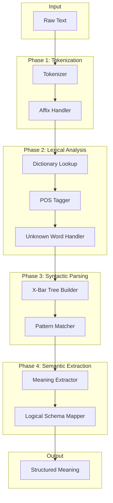
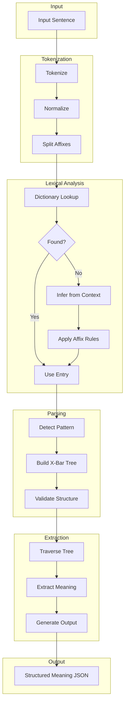

# X-Bar Theory NLP Analyzer - Comprehensive Analysis

## Table of Contents
1. [Existing Project State Summary](#existing-project-state-summary)
2. [X-Bar Theory Explanation](#x-bar-theory-explanation)
3. [Recommended Architecture](#recommended-architecture)
4. [Data Structures](#data-structures)
5. [Implementation Roadmap](#implementation-roadmap)

---

## Existing Project State Summary

### Project Philosophy
The project aims to build a **deterministic, rule-based Natural Language Meaning Processing library** that:
- Relies on grammatical syntax and semantic logic (not neural networks)
- Produces 100% deterministic output (same input → same output)
- Explicitly fails on ambiguity rather than guessing
- Focuses on logical meaning extraction, not sentiment analysis

### Current Implementation ([`index.html`](index.html))

The existing codebase contains a working prototype with:

#### Lexicon System
```javascript
LEXICON = {
    "carl": { type: "Noun", semantic: "Subject", class: "Man" },
    "is": { type: "Copula", semantic: "Assignment" },
    "a": { type: "Determiner", semantic: "Classifier" },
    // ... more entries
}
```

#### Pattern Matching
The [`Analyzer`](index.html:287) class currently handles three sentence patterns:
1. **Inheritance Pattern**: `[Noun, Copula, Determiner, Noun]` → "Amanda is a girl"
2. **Property Pattern**: `[Noun, Copula, Adjective]` → "The apple is red"
3. **Action Pattern**: `[Noun, Verb, Noun]` → "Man sells car"

#### Tree Generation
Generates X-Bar tree structures with:
- **TP** (Tense Phrase) as root
- **NP** (Noun Phrase) for subjects/objects
- **VP** (Verb Phrase) for actions
- **AP** (Adjective Phrase) for properties

### Data Structure Ideas ([`useful_resources/info.md`](useful_resources/info.md))

The project plans four data file types:

| Type | Purpose | Key Fields |
|------|---------|------------|
| **Affix** | Handle prefixes/suffixes | Type, POS, Meaning, Resulted POS |
| **Language Tools** | Handle non-Noun/Verb POS | Before/After POS, Context, Categories |
| **Noun Dictionary** | Noun definitions | noun, category_list, singularity |
| **Verb Dictionary** | Verb definitions | verb, owner (valid subjects) |

### Visual Diagram ([`charts/excalidraw/x-bar_word_components.excalidraw`](charts/excalidraw/x-bar_word_components.excalidraw))

Shows word decomposition: **Word → [Prefix, Base, Suffix]**

---

## X-Bar Theory Explanation

### What is X-Bar Theory?

X-Bar Theory is a **generative linguistics framework** developed by Noam Chomsky that provides a **template for phrase structure**. It captures the intuition that all phrases in natural language share a common structural pattern, regardless of their category (noun, verb, adjective, etc.).

### Core Components

#### The Three-Level Hierarchy

```
        XP (Maximal Projection)
       /  \
    Spec   X'
          /  \
       X    Comp
     (head) (complement)
```

| Level | Notation | Name | Description |
|-------|----------|------|-------------|
| **X** | X | Head | The core word that determines the phrase type |
| **X'** | X-bar | Intermediate | Contains head + complement; can be recursive |
| **XP** | X-double-bar / XP | Maximal Projection | Complete phrase with specifier |

#### Key Components

1. **Head (X)**: The obligatory core
   - Determines the phrases syntactic category
   - Examples: N in NP, V in VP, A in AP, P in PP

2. **Complement**: Sisters to the head
   - Closely related to the head meaning
   - Examples: "the book" in "read the book", "to the store" in "walk to the store"

3. **Specifier**: Sisters to X-bar, daughters of XP
   - Provides additional context or modification
   - Examples: "the" in "the book", "very" in "very happy"

4. **Adjunct**: Optional modifiers
   - Can be added recursively to X-bar
   - Examples: "quickly" in "run quickly", "red" in "the red book"

### Phrase Type Examples

#### Noun Phrase (NP)
```
        NP
       /  \
    Det    N'
          /  \
         N    PP
       "book" "on the table"
```
- **Head**: N (book)
- **Specifier**: Det (the)
- **Complement**: PP (on the table)

#### Verb Phrase (VP)
```
        VP
       /  \
    (Spec)  V'
          /    \
         V      NP
       "reads"  "books"
```
- **Head**: V (reads)
- **Complement**: NP (books)

#### Adjective Phrase (AP)
```
        AP
       /  \
   (Spec)  A'
          /  \
         A    (Comp)
      "happy"
```
- **Head**: A (happy)
- **Specifier**: "very" (if present)

#### Prepositional Phrase (PP)
```
        PP
       /  \
    (Spec)  P'
          /    \
         P      NP
        "in"   "the house"
```

### Tense Phrase (TP) - Sentence Level

X-Bar theory extends to sentences via **TP (Tense Phrase)**:

```
        TP
       /  \
    NP     T'
  (subj)  /  \
        T    VP
      (tense)
```

- **Specifier of TP**: Subject NP
- **Head (T)**: Tense marker (past/present, or copula "is/are")
- **Complement**: VP

### Binary Branching Principle

X-Bar theory enforces **binary branching** - each node has at most two children:
- This simplifies parsing logic
- Creates consistent tree structures
- Enables recursive processing

### Application to Parsing

For NLP parsing, X-Bar theory provides:

1. **Predictive Structure**: Knowing the head predicts possible phrase structures
2. **Hierarchical Meaning**: Tree structure directly maps to semantic relationships
3. **Compositional Semantics**: Meaning builds bottom-up from heads to phrases
4. **Disambiguation**: Structural constraints help resolve ambiguity

---

## Recommended Architecture

### High-Level Architecture



### Core Modules

#### 1. Tokenizer Module
- Split text into tokens
- Handle punctuation
- Normalize case

#### 2. Affix Handler Module
- Strip prefixes/suffixes
- Map affix meanings
- Handle morphological variations

#### 3. Lexicon Module
- Dictionary lookups for nouns, verbs, etc.
- Category inheritance
- Semantic properties

#### 4. X-Bar Parser Module
- Build phrase structures
- Apply X-Bar templates
- Handle recursion

#### 5. Meaning Extractor Module
- Traverse tree structure
- Extract semantic relations
- Output structured data

---

## Data Structures

### 1. Token Structure

```javascript
Token = {
    text: string,           // Raw text
    normalized: string,     // Lowercase, no punctuation
    position: number,       // Index in sentence
    affixes: {
        prefix: string[],   // Detected prefixes
        suffix: string[]    // Detected suffixes
    },
    base: string            // Root word after affix removal
}
```

### 2. Lexical Entry Structure

```javascript
LexicalEntry = {
    word: string,
    type: POS,              // Noun | Verb | Adjective | Determiner | etc.
    semantic: SemanticRole, // Subject | Object | Action | Property | etc.
    properties: {
        category: string[], // [person, female] for "Amanda"
        number: Number,     // Singular | Plural
        tense: Tense,       // For verbs: Past | Present | Future
        transitive: boolean // For verbs
    }
}
```

### 3. Affix Entry Structure

```javascript
AffixEntry = {
    affix: string,          // "un", "able", "s"
    type: AffixType,        // Prefix | Suffix
    appliesTo: POS[],       // [Noun, Verb] - valid input POS
    meaning: string,        // "not", "capable of"
    resultPOS: POS,         // Output part of speech
    examples: string[]      // ["unhappy", "movable"]
}
```

### 4. X-Bar Node Structure

```javascript
XBarNode = {
    type: NodeType,         // XP | XBar | X | Leaf
    category: Category,     // N | V | A | P | T | D
    label: string,          // Display label
    children: XBarNode[],   // Child nodes (max 2 for binary branching)
    data: {
        head: XBarNode,     // Reference to head (for XP/XBar)
        specifier: XBarNode,
        complement: XBarNode,
        adjuncts: XBarNode[]
    },
    semantic: {
        role: SemanticRole,
        value: any
    }
}
```

### 5. Phrase Templates

```javascript
PhraseTemplate = {
    name: string,           // "NP", "VP", "AP"
    headCategory: Category, // N, V, A
    structure: {
        allowsSpecifier: boolean,
        specifierTypes: POS[],
        allowsComplement: boolean,
        complementTypes: Category[],
        allowsAdjuncts: boolean,
        adjunctTypes: Category[]
    }
}
```

### 6. Sentence Pattern Structure

```javascript
SentencePattern = {
    name: string,           // "Inheritance", "Property", "Action"
    posSequence: POS[],     // [Noun, Copula, Determiner, Noun]
    treeTemplate: Function, // Function to generate X-Bar tree
    semanticMapping: {
        subject: number,    // Index in sequence
        predicate: number,
        object: number
    }
}
```

### 7. Meaning Output Structure

```javascript
MeaningOutput = {
    type: SentenceType,     // Inheritance | Property | Action
    subject: {
        entity: string,
        category: string[],
        properties: object
    },
    predicate: {
        type: PredicateType, // IsA | HasProperty | Does
        value: any,
        negated: boolean
    },
    object: {
        entity: string,
        category: string[],
        properties: object
    },
    confidence: 1.0         // Always 1.0 for deterministic system
}
```

---

## Implementation Roadmap

### Phase 1: Foundation

#### 1.1 Project Structure
- [ ] Create modular file structure
- [ ] Set up build system (ES modules or CommonJS)
- [ ] Create test framework

#### 1.2 Core Data Files
- [ ] Implement affix dictionary JSON
- [ ] Implement noun dictionary JSON
- [ ] Implement verb dictionary JSON
- [ ] Implement language tools JSON

#### 1.3 Basic Tokenizer
- [ ] Word splitting
- [ ] Punctuation handling
- [ ] Case normalization

### Phase 2: Lexical Analysis

#### 2.1 Dictionary System
- [ ] Dictionary lookup module
- [ ] Multi-dictionary search
- [ ] Fallback for unknown words

#### 2.2 Affix Processing
- [ ] Prefix detection and stripping
- [ ] Suffix detection and stripping
- [ ] Morphological analysis
- [ ] Word reconstruction

#### 2.3 POS Tagging
- [ ] Rule-based tagger
- [ ] Context-aware disambiguation
- [ ] Unknown word inference

### Phase 3: X-Bar Parser

#### 3.1 Tree Data Structure
- [ ] XBarNode class
- [ ] Tree traversal utilities
- [ ] Tree visualization

#### 3.2 Phrase Builders
- [ ] NP builder
- [ ] VP builder
- [ ] AP builder
- [ ] PP builder
- [ ] TP builder

#### 3.3 Pattern Matching
- [ ] Sentence pattern detection
- [ ] Pattern-to-tree mapping
- [ ] Error handling for unknown patterns

### Phase 4: Semantic Extraction

#### 4.1 Tree Traversal
- [ ] Bottom-up meaning composition
- [ ] Head-driven interpretation
- [ ] Specifier/complement handling

#### 4.2 Meaning Mapping
- [ ] Inheritance extraction ("X is a Y")
- [ ] Property extraction ("X is ADJ")
- [ ] Action extraction ("X verbs Y")

#### 4.3 Output Generation
- [ ] JSON schema output
- [ ] Validation
- [ ] Error reporting

### Phase 5: Enhancement

#### 5.1 Extended Patterns
- [ ] Negation handling ("X is not Y")
- [ ] Questions
- [ ] Complex sentences
- [ ] Conjunctions

#### 5.2 Robustness
- [ ] Grammar validation
- [ ] Ambiguity detection
- [ ] Error messages

#### 5.3 Integration
- [ ] API design
- [ ] Documentation
- [ ] Examples

---

## Key Design Decisions

### 1. Binary Branching
**Decision**: Enforce binary branching in X-Bar trees
**Rationale**: Simplifies parsing, consistent with linguistic theory, enables recursive algorithms

### 2. Pattern-Based Parsing
**Decision**: Use sentence pattern matching before tree building
**Rationale**: Current prototype shows this works well for simple sentences; can be extended

### 3. Deterministic Output
**Decision**: Always produce same output for same input; fail explicitly on ambiguity
**Rationale**: Aligns with project philosophy; enables debugging and verification

### 4. Modular Dictionary System
**Decision**: Separate dictionaries for nouns, verbs, affixes, language tools
**Rationale**: Easier to maintain, extend, and test independently

### 5. Affix-First Processing
**Decision**: Process affixes before dictionary lookup
**Rationale**: Handles unknown words by reducing to base form; supports morphological richness

---

## Mermaid Diagram: Complete System Flow



---

## Conclusion

This analysis provides a foundation for building a rule-based NLP analyzer using X-Bar theory. The key insights are:

1. **X-Bar theory provides a consistent template** for phrase structure that can be algorithmically implemented
2. **The current prototype** demonstrates feasibility for simple sentence patterns
3. **A modular architecture** with separate dictionaries, parsers, and extractors will enable systematic development
4. **Binary branching and pattern matching** provide the structural backbone for parsing
5. **Deterministic processing** requires explicit handling of all cases with clear error reporting

The implementation should proceed in phases, starting with the foundation (tokenization, dictionaries) and building up to full X-Bar parsing and meaning extraction.
